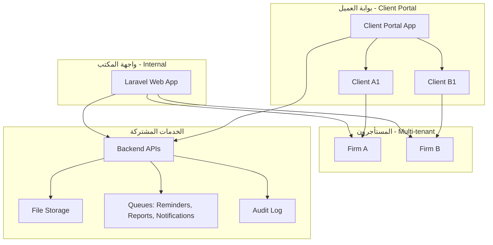
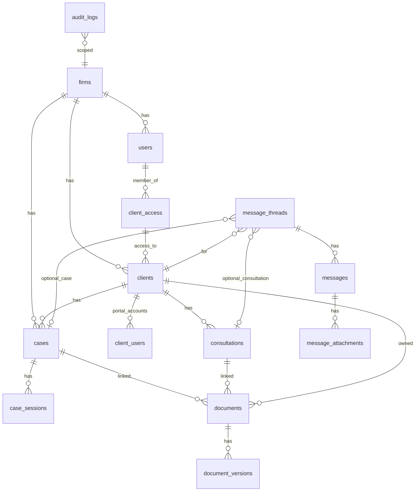
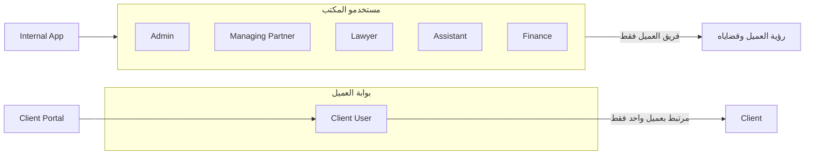

# مخطط مشروع ALOS – Law Firms Edition

## 1. السياق الحالي للمنصة

المشروع الحالي ([alos-platform](D:\laragon\www\alos-platform)) عبارة عن **Laravel 12** مع Blade و Vite و Tailwind، وبدون:

- نظام مصادقة واجهات (Login/Register)
- عملاء، قضايا، استشارات، مستندات، محادثات
- Multi-tenancy (مكاتب/شركات)

كل ما في SRD سيُبنى فوق هذا الهيكل.

---

## 2. هندسة النظام على مستوى عالي

- **مساران وصول:** مسار للمكتب (Internal) ومسار للعميل (Client Portal)، كلاهما يعتمد على نفس الـ Backend وبنفس قاعدة البيانات مع عزل منطقي حسب `firm_id` و `client_id`.
- **Multi-tenant:** كل البيانات (عملاء، قضايا، مستندات، محادثات) مُعلَّقة بمكتب (Firm). المستخدم الداخلي يعمل في سياق مكتب واحد؛ مستخدم البوابة مرتبط بعميل واحد فقط ضمن مكتب.

---

## 3. نموذج البيانات الأساسي (مختصر)

**الكيانات الرئيسية:**

| الكيان               | الوصف                                                                                                          |
| -------------------- | -------------------------------------------------------------------------------------------------------------- |
| **firms**            | المكاتب (المستأجرون): اسم، إعدادات، SMTP اختياري                                                               |
| **users**            | مستخدمو المكتب: `firm_id`, `role` (admin, managing_partner, lawyer, assistant, finance)                        |
| **clients**          | العملاء: `firm_id`, نوع (خارجي/مشترك ALOS)، مستوى سرية، ملاحظات                                                |
| **client_users**     | حسابات بوابة العميل: `client_id`, username, email, password, صلاحيات البوابة، active                           |
| **client_access**    | فريق العميل: `client_id`, `user_id`, دور (lead_lawyer, lawyer, assistant)                                      |
| **cases**            | القضايا: `client_id`, رقم، نوع، جهة، محامي مسؤول، حالة                                                         |
| **consultations**    | الاستشارات: `client_id`, تاريخ، مسؤول، ملخص، مرفقات                                                            |
| **documents**        | المستندات: `firm_id`, `client_id`, case_id/consultation_id اختياري، اسم، وصف، shared_with_client، مسار التخزين |
| **message_threads**  | سلاسل المحادثات: `client_id`, case_id/consultation_id اختياري، موضوع                                           |
| **messages**         | الرسائل: `thread_id`, مرسل (user أو client_user)، نص، وقت، مرفقات                                              |
| **case_sessions**    | جلسات القضايا: `case_id`, تاريخ/وقت، محكمة، موقع، ملاحظات داخلية                                               |
| **report_schedules** | جدولة التقارير: عميل، نوع تقرير، تردد (أسبوعي/شهري)، مستقبلون                                                  |
| **reminder_rules**   | قواعد التذكيرات: قبل 7 أيام / 24 ساعة / 2 ساعة، قنوات (in-app, email)                                          |
| **audit_logs**       | سجل التدقيق: firm_id, user/client_user, action, entity, entity_id, payload, ip                                 |

الملفات تُخزَّن عبر Laravel Storage (مجلدات حسب firm/client/document مع صلاحيات وصول في الـ API).

---

## 4. المستخدمون والأدوار والوصول

- **داخل المكتب:** صلاحيات حسب الدور (Admin كامل، Managing Partner إدارة المكتب، Lawyer/Assistant/Finance حسب client_access). من يظهر في **فريق العميل** (client_access) فقط يرى هذا العميل وقضاياه واستشاراته ومحادثاته ومستنداته.
- **بوابة العميل:** مستخدم البوابة (client_user) مرتبط بـ **عميل واحد**. كل الطلبات (قضايا، استشارات، مستندات، محادثات) تُفلتر بـ `client_id`؛ أي طلب خارج نطاق هذا العميل يُرجع **404 Not Found** ويُسجَّل في Audit Log.

---

## 5. بوابة العميل (Client Portal) – نطاق الوظائف

| المكون           | الوظيفة                                                                                                                                                  |
| ---------------- | -------------------------------------------------------------------------------------------------------------------------------------------------------- |
| **إنشاء الحساب** | من ملف العميل (داخل المكتب): إنشاء client_user (username, email, كلمة مرور عبر دعوة/Reset)، تفعيل/تعطيل، صلاحيات (عرض فقط / تواصل / تواصل + رفع مستندات) |
| **لوحة العميل**  | بعد تسجيل الدخول: بياناته، بيانات المكتب، قائمة قضاياه (حالة + آخر تحديث + ملفات مشتركة)، قائمة استشاراته، مركز المستندات، مركز المحادثات                |
| **المحادثات**    | Thread لكل محادثة، ربط اختياري بقضية/استشارة، إرفاق ملفات، لا حذف (أرشفة فقط)، تسجيل كل رسالة مع الوقت والمرسل                                           |
| **المستندات**    | العميل يرفع (حسب الصلاحية)؛ المكتب يشارك؛ المستند مرتبط بعميل + اختياري قضية/استشارة؛ العميل يرى فقط "مشارك معه" وليس الداخلي                            |
| **الأمان**       | كل طلبات البوابة مُقيَّدة بـ client_id؛ منع البحث/التنقل خارج النطاق؛ تسجيل في Audit Log                                                                 |

يفضل فصل بوابة العميل عن واجهة المكتب: إما subdomain (مثل `portal.alos.app`) أو مسار مخصص (مثل `/portal`) مع Middleware يفرق بين `User` و `ClientUser` ويمنع خلط السياق.

---

## 6. تذكيرات الجلسات والتقارير التلقائية

- **الجلسات (case_sessions):** إدخال من واجهة المكتب (تاريخ، وقت، محكمة، موقع، ملاحظات داخلية، مسؤول).
- **التذكيرات:** Jobs مجدولة (Laravel Scheduler) تفحص الجلسات القادمة وتطبق قواعد (قبل 7 أيام / 24 ساعة / 2 ساعة)؛ إشعار داخل المنصة (جدول notifications) + إيميل إن وُجد SMTP؛ المستلمون: المحامي المسؤول + فريق القضية + اختياري العميل.
- **التقارير التلقائية:** تقارير MVP: حالة القضايا، ملخص النشاط (أسبوعي/شهري)، مستندات جديدة مشتركة. Jobs مجدولة حسب إعدادات كل عميل (أسبوعي/شهري/عند تحديث مهم)؛ إرسال Email أو إشعار في المنصة مع تنزيل PDF.

---

## 7. الامتثال وسجل التدقيق

- **محرك الامتثال:** قبل أي إجراء حساس (تعديل عميل، تغيير فريق، مشاركة مستند، إرسال رسالة، تعديل جلسة، إرسال تقرير): التحقق من الصلاحية، اكتمال البيانات، منع تعديل العناصر المقفلة؛ منع الوصول غير المصرح (Not Found)؛ تسجيل المحاولات المخالفة في سجل الامتثال/التدقيق.
- **Audit Log:** جدول audit_logs يسجل: إنشاء/تعديل عميل، تغيير فريق العميل، رفع/حذف/مشاركة مستند، إرسال رسائل، تعديل موعد جلسة، إرسال تقرير، دخول العميل للبوابة ومحاولات الوصول، مع (user/client_user, action, entity, entity_id, payload, ip, timestamp).

---

## 8. هيكل التطبيق المقترح (Laravel)

- **Routes:** `routes/web.php` للمكتب (مع auth middleware)؛ `routes/portal.php` أو `routes/client.php` للبوابة (مع client-auth)؛ `routes/api.php` للـ APIs إن وُجدت (للمكتب و/أو البوابة).
- **Models:** Firm, User (توسيع مع firm_id, role), Client, ClientUser, ClientAccess, Case, Consultation, Document, MessageThread, Message, CaseSession, ReportSchedule, ReminderRule, AuditLog.
- **Policies / Middleware:** عزل حسب firm (EnsureUserBelongsToFirm)، عزل حسب client للبوابة (EnsureClientUserScope)، التحقق من فريق العميل (ClientAccessPolicy) للوصول لملف العميل والقضايا والاستشارات والمستندات والمحادثات.
- **Storage:** أقراص منفصلة أو مجلدات مثل `firms/{id}/documents/` و `firms/{id}/messages/` مع التحقق من الصلاحية عند التحميل/التنزيل.
- **Queue & Scheduler:** إرسال التذكيرات، إرسال التقارير، إشعارات البريد؛ استخدام Laravel Notifications للـ in-app و optional Email.

---

## 9. مراحل التنفيذ المقترحة (ترتيب MVP)

1. **الأساس:** Multi-tenancy (جدول firms، firm_id في users)، نظام مصادقة (مثل Breeze) + أدوار المستخدم الداخلي (Admin, Managing Partner, Lawyer, Assistant, Finance).
2. **العملاء والوصول:** نموذج Client و ClientAccess؛ ملف العميل (Tabs: بيانات، قضايا، استشارات، محادثات، مستندات، فريق الوصول)؛ سياسة "فريق العميل فقط".
3. **القضايا والاستشارات:** Case، Consultation، ربطهما بالعميل والمحامي المسؤول؛ واجهات CRUD داخل المكتب.
4. **بوابة العميل:** نموذج ClientUser، مصادقة البوابة، إنشاء حساب من ملف العميل؛ لوحة العميل (قضايا، استشارات، مستندات، محادثات) مع عزل كامل حسب client_id.
5. **المحادثات والمستندات:** MessageThread، Message (مع مرفقات)، ربط Thread بقضية/استشارة؛ Document مع رفع/مشاركة وحالة shared_with_client؛ واجهات في المكتب والبوابة.
6. **الجلسات والتذكيرات:** CaseSession، ReminderRule، Jobs للتذكيرات (in-app + email).
7. **التقارير التلقائية:** أنواع التقارير (حالة قضايا، ملخص نشاط، مستندات جديدة)، ReportSchedule، Jobs للإرسال (email أو إشعار + PDF).
8. **سجل التدقيق والامتثال:** AuditLog، middleware/observers لتسجيل العمليات الحساسة، منع الوصول غير المصرح وتسجيل المحاولات.

---

## 10. متطلبات غير وظيفية

- واجهة عربية RTL (Tailwind + اتجاه RTL في الـ layout).
- صلاحيات دقيقة عبر Policies و Middleware و client_access.
- أداء: فهرسة (client_id, firm_id, case_id)، تحميل كسول للمحادثات والمستندات، تخزين ملفات مع CDN/storage مناسب إن لزم.
- HTTPS، حماية الملفات بصلاحيات، تصميم قابل للتوسع (كل جدول رئيسي يحتوي firm_id أو ربط عبر client → firm).

هذا المخطط يغطي SRD ويضع أساس تنفيذ ALOS – Law Firms Edition مع التأكيد على أن **التواصل والمستندات داخل ALOS فقط** والعميل يملك **حساب مستخدم لصفحة خاصة به** مع عزل كامل وسجل تدقيق.